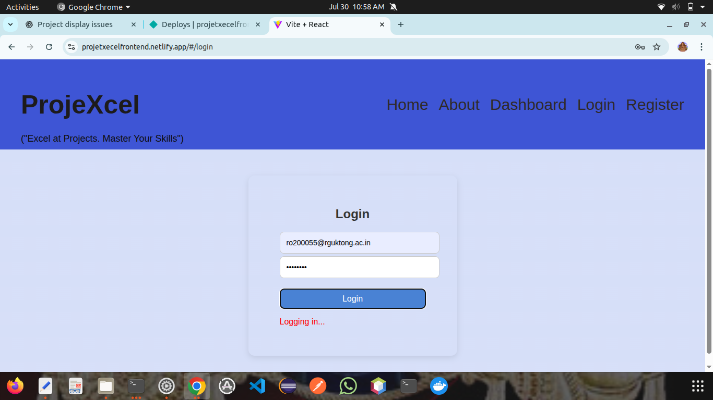
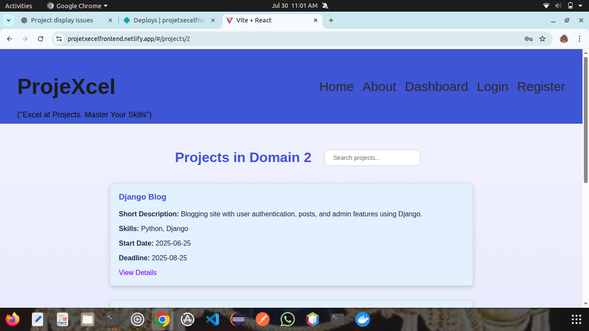
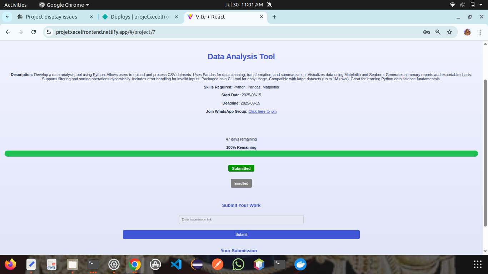

# 🚀 ProjeXcel – Full Stack Project Management Portal

A complete **Java Full Stack** application that allows users to register, log in, browse domains, view projects, and enroll or manage their project choices.

---

## 📌 Project Repositories

- 🔙 **Backend** (Spring Boot + MySQL):  
  👉 [projeXcel (Backend Repo)](https://github.com/Chandu078997/projeXcel)

- 🌐 **Frontend** (React.js):  
  👉 [projeXecel_frontend (Frontend Repo)](https://github.com/Chandu078997/projeXecel_frontend) ← *You are here*

---

## 🌍 Live Demo

| Application | URL |
|-------------|-----|
| Frontend    | [View on Netlify](https://your-frontend-url.netlify.app) |
| Backend     | [View on Render](https://your-backend-url.onrender.com) |

---

## 🔑 Features

✅ User Registration & Login  
✅ Role-based Dashboard  
✅ View Domains & Projects  
✅ Enroll in Projects  
✅ Project Details Page   
✅ Protected Routes (Frontend Auth)  
✅ REST API Integration  
✅ MySQL Database Storage

---

## 🛠️ Tech Stack

| Layer      | Technology              |
|------------|--------------------------|
| Frontend   | React.js, React Router   |
| Backend    | Spring Boot, Java        |
| Database   | MySQL                    |
| Styling    | CSS                      |
| Auth       | SessionStorage, API-based|
| Deployment | Netlify (Frontend), Render (Backend) ,mysql(Railway)|

---

## 🧪 How It Works

1. Users sign up and log in via the frontend.
2. Auth state is maintained using session storage.
3. Backend APIs handle:
   - Authentication
   - Project & domain data
   - Enrollments
   -submission of project
4. MySQL stores all user and project data.

---

## 📸 Screenshots

<!-- Add your app screenshots here -->


### 🔐 Login Page


### 📁 Projects Page


### 📄 Project Details Page

## 🧰 How to Run Locally

### 🔧 Backend (Spring Boot)
```bash
# Clone backend repo
git clone https://github.com/Chandu078997/projeXcel
cd projeXcel

# Configure MySQL credentials in application.properties

# Run the app (e.g., in Eclipse, IntelliJ, or using Maven)
